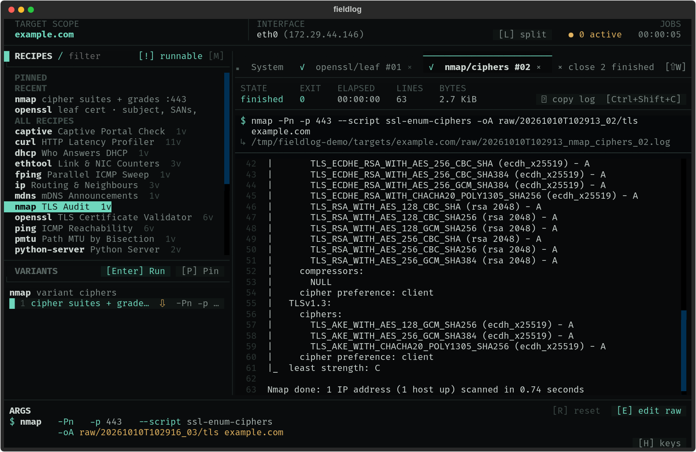

# fieldlog

<p align="center"></p>

fieldlog - log what you did in the field.

A terminal UI and CLI for running network diagnostic tools from a catalog of
saved commands, and keeping a log of every run. You pick a tool and a target;
fieldlog runs the command, streams the output, and files the log plus a run
record under `targets/<name>/`. The archive is the point: a week later you can
see exactly what was run against a host, when, with what result.



```bash
fieldlog run ping/quick 192.168.1.20
fieldlog history 192.168.1.20
fieldlog report 192.168.1.20 -o ping-report.md
```

```text
targets/192.168.1.20/
├── session.json                                  # one record per run
└── raw/20260912T180156_ping_quick_01.log         # what ping printed
```

## Requirements

- Linux or macOS (the runner uses a pty; Windows is not supported — WSL works)
- Python 3.11 or newer
- The tools themselves: ping, curl, dig, traceroute and so on. fieldlog does not
  bundle them. A tool missing from `$PATH` is listed but marked as unavailable.
- Root, or the right capabilities, for tools that need it (tcpdump, arp-scan,
  `ping -f`). fieldlog does not escalate; write `sudo` into the recipe if you want it.

Two things differ on macOS. `--timeout` needs coreutils `timeout`, which Homebrew
installs as `gtimeout` (`brew install coreutils`); without either, `run` refuses
the flag rather than running the job unbounded. And the copy keys write OSC 52,
which Terminal.app does not support — iTerm2 and others do (see [Keys](#keys)).

## Install

```bash
pipx install git+https://github.com/proverbial-toast/fieldlog        # latest main
pipx install git+https://github.com/proverbial-toast/fieldlog@v0.5.0 # a release
fieldlog            # opens the TUI
```

Every tagged release also carries a built wheel and sdist on its
[releases page](https://github.com/proverbial-toast/fieldlog/releases), if you
would rather install one directly than build from a checkout:

```bash
pipx install https://github.com/proverbial-toast/fieldlog/releases/download/v0.5.0/fieldlog-0.5.0-py3-none-any.whl
```

For development:

```bash
git clone https://github.com/proverbial-toast/fieldlog && cd fieldlog
uv sync --extra dev             # or: python3 -m venv .venv && . .venv/bin/activate && pip install -e '.[dev]'
uv run pytest                   # or: pytest
```

## Your own recipes

The built-in catalog is a starting point; fieldlog is meant to hold the commands
*you* run. A recipe is a few lines of YAML in `~/.config/fieldlog/recipes.d/`, and
[`recipes.d/example.yaml.sample`](recipes.d/example.yaml.sample) is one to copy.

To start from a blank slate, switch every built-in theme off in
`~/.config/fieldlog/themes.yaml`. Only your own recipes load:

```yaml
themes:
  reach: false
  dns: false
  http-tls: false
  local: false
  capture: false
  scan: false
  throughput: false
  quality: false
  neighbourhood: false
  chains: false
```

Delete a line to bring that theme back. [docs/recipes.md](docs/recipes.md) covers the format.

## Terms

| Term | Meaning | Example |
|------|---------|---------|
| **Tool** | An entry under `recipes:`: one binary plus its presets. | `ping` |
| **Preset** | One saved set of flags for a tool. Called a **variant** in the TUI. | `quick` |
| **Recipe ID** | `tool/preset`, how the CLI names something runnable. | `ping/quick` |
| **Chain** | An entry under `chains:`: recipe IDs run in order against one scope. | `reach` |
| **Scope** | The target, DNS name, interface and local address a run is aimed at. | `192.168.1.0/24` |
| **Workspace** | The archive root, `./targets` by default. One folder per target inside it. | `~/audits` |

## TUI

Run `fieldlog`, or `fieldlog tui`. Press `?` for the full key list.

To start with the scope already set, pass it to `tui`. It takes the same scope
flags as `run`:

```bash
fieldlog tui 192.168.1.20 -i eth0                        # or -t 192.168.1.20
fieldlog tui -t 192.168.1.0/24 -H router1 -i eth0 -w ~/audits
```

The scope is remembered per workspace in `<workspace>/.last-scope.json`, so a
bare `fieldlog` resumes where you left off; any flag you pass overrides the
remembered value. If no interface is passed or remembered, the TUI starts on the
platform's default (`eth0` on Linux, `en0` on macOS) if it has an IPv4 address,
else on the first other interface that has one (never loopback). An interface you
name is kept even with no address yet, such as a VPN that comes up later. `T`
changes all of it at runtime.

`$LHOST` is the address the interface has when a job starts, unless you set one:
with `-l`, or by typing `tun0 / 10.8.0.2` in the interface field of `T`. Typing
just `tun0`, or clicking an interface in the list, goes back to its own address.
Only an address you set is remembered. `fieldlog run` never switches
interfaces: without `-i` it uses that same default.

### Keys

| Key | Action |
|-----|--------|
| `T` | Set target, DNS name, interface, local address and log destination: where logs and `$OUTDIR` go instead of the workspace, `--artifact-root` on the CLI |
| `↑ ↓` `j k` | Move within the focused pane |
| `Tab` | Switch focus between RECIPES and VARIANTS |
| `Esc` | Back out one step: the args editor, then the filter, then VARIANTS to RECIPES. Never quits |
| `Enter` | Jump to VARIANTS — a chain's STEPS — with the row selected; `Enter` there runs it |
| `1`–`9`, `0` | Select variant 1–10 of the current tool, or read step 1–10 of a chain |
| `,` `.` | Previous / next variant, or step of a chain |
| `/` | Filter recipes. `Esc` clears it |
| `!` | Toggle runnable-only (default) / show everything. Runnable-only hides what is not installed; a recipe or chain waiting on a target or DNS name stays, dimmed |
| `Ctrl+P` | Palette. `Enter` loads a recipe's args, `Shift+Enter` runs it. Type `>` for commands only |
| `E` | Edit the args of the selected variant (raw template). `Esc` or `Ctrl+J` applies |
| `R` | Reset edited args to the variant default |
| `P` | Pin / unpin the selected variant or chain |
| `[` `]` | Previous / next output tab |
| `Ctrl+W` | Close the active tab. A running job asks: kill, or detach and keep it running. While typing in the filter or the args editor, it deletes a word instead |
| `Shift+W` | Close every finished tab |
| `Ctrl+C` | Send SIGINT to the active tab's job |
| `Y` | Copy `tail -f <log>` for the active tab to the clipboard. On the System tab that is `<workspace>/fieldlog.log`, the session transcript |
| `Ctrl+Shift+C` | Copy the active tab's log to the clipboard, the last 500 KB if it is longer. Many terminals keep this key for their own copy; the *Copy active log* command in `Ctrl+P` does the same |
| `M` | Recipe manager: sources, drop-ins, overrides, missing tools |
| `Shift+R` | Reload recipes. Running jobs are untouched |
| `L` | Toggle split / stacked layout (stacked is automatic under 120 columns) |
| `H` | Show / hide the hotkey bar |
| `Q Q` | Quit (double-tap). Asks first if jobs are running (detached ones too), then stops them and keeps their records; quit again to leave without waiting |

Both copy keys use OSC 52: fieldlog writes the text as an escape sequence and
your terminal puts it on the clipboard. That works over ssh, and nothing is
copied on the remote machine. It needs a terminal that supports OSC 52 (macOS
Terminal does not) and, inside tmux, `set -g set-clipboard on`.

The RECIPES pane lists **Pinned** (`P`) and **Recent** above **All Recipes**.
Recent holds the last six recipes or chains launched from the TUI; runs started
with `fieldlog run` are not added. `Ctrl+P` with nothing typed shows the same
pinned and recent entries. Both lists are kept per workspace in
`.pinned-recent.json`.

### Jobs

Every run opens its own tab and runs at once; start ping and curl and both hit
the wire together. `Ctrl+C` interrupts only the tab you are on, and the tab
then shows whatever exit code the tool returned, marked `interrupted`. The
System tab keeps fieldlog's own running commentary — spawns, kills, detaches,
scope changes, reloads — and its lines are also appended, each with the time it
happened, to `<workspace>/fieldlog.log`.

If a job stops at a prompt (`[y/N]`, a passphrase), a reply field appears under
its output: type the answer and press `Enter`, or click one of the chips
fieldlog offers for a `[y/N]`-style prompt. `Esc` leaves the field with the
job still waiting. Prompts that read the terminal directly, such as sudo and
ssh, work the same way because each job owns its own pty. Hotkeys are
suspended while the reply field has focus.

The log shows the reply, as `› yes`, only when it is one of the choices the
prompt lists in brackets, such as `[y/N]` or `(yes/no/[fingerprint])`. Any
other reply, such as a passphrase, is logged as `› (reply hidden)`. `fieldlog run`
forwards keystrokes to the job and logs none of them.

The target and DNS name cannot be changed while a job is running; stop the
jobs first. The interface and log destination can.

The ARGS band shows the command that will run. `E` opens the raw editor on the
*template*, so `$TARGET` stays `$TARGET` and an edit made under one target
still runs correctly against the next. Edits are per recipe and live for the
session; `R` restores the variant default.

## CLI

```bash
fieldlog list                            # one line per tool, then the chains
fieldlog list ping                       # a tool id: that tool's recipes
fieldlog list sweep                      # anything else: search recipe id, tool, preset name and flags
fieldlog list -V                         # every recipe with its flags (also with a tool or search)
fieldlog list --runnable                 # only tools found in $PATH
fieldlog list -q                         # tool/preset IDs and chain ids, one per line, nothing else (for fzf / xargs)
fieldlog list --json

fieldlog show ping                       # a tool's first preset, with its contract (success, parse, expect) when set
fieldlog show ping/quick -t 192.168.1.20 -H router1     # with the variables filled in
fieldlog show reach -t 192.168.1.20      # a chain: every step's resolved command

fieldlog run ping/quick 192.168.1.20                # target as an argument...
fieldlog run ping/quick -t 192.168.1.20             # ...or as a flag
fieldlog ping/quick 192.168.1.20                    # "run" is optional
fieldlog run ping 192.168.1.20                      # a tool id alone: its first preset, ping/quick
fieldlog run ping/quick 192.168.1.20 --dry-run      # print command, env and paths; run nothing
fieldlog run ping/quick 192.168.1.20 --extra-args "-c 1"
fieldlog run reach 192.168.1.20                     # a chain: its recipes in order

fieldlog history                         # target folders, with run counts and each folder's last run
fieldlog history 192.168.1.20            # runs for one folder
fieldlog history router1 --json
fieldlog history router1 --recipe ping/quick --fields    # one column per parsed field, across runs
fieldlog history router1 --since 3h                      # only runs from the last three hours

fieldlog note router1 "customer confirmed the outage at 14:10"   # a timestamped note in the archive

fieldlog report 192.168.1.20                        # every run as Markdown on stdout
fieldlog report router1 --tail 10                   # 10 lines of each log instead of 40
fieldlog report router1 --full -o run-report.md     # whole logs, written to a file
fieldlog report router1 --since today -o today.md  # today's visit, ready for your notes
fieldlog report router1 --recipe ping/quick         # only that recipe's runs

fieldlog doctor                                     # what can run now, and what's missing
fieldlog doctor 192.168.1.20 -H router1             # runnability against a scope
fieldlog doctor --json                              # the same report as a JSON record
```

Wherever `run`, `show` or a chain step expects a recipe ID, a tool id alone
means that tool's first preset, and for `run` and `show` a chain id means the
chain. The bare form `fieldlog <recipe> <target>` takes all three, as long as
the id is not itself a command name (`list`, `show`, `run`, `history`,
`note`, `report`, `doctor`, `tui`, or their aliases `ls`, `recipes`, `info`,
`exec`, `log`, `runs`, `check`).

`history` and `report` look up a target folder, named for the DNS name if the
runs had one, else the target. Either spelling finds it: after
`fieldlog run ping/quick 192.168.1.20 -H router1`, both `history router1` and
`history 192.168.1.20` work. With no name, or one it does not know,
`fieldlog history` lists the folders.

`fieldlog note <name> "text"` adds a timestamped note to a target's archive.
It takes a run number of its own, so `history` and `report` show it in its
place among the runs. `<name>` is the folder or the target, as for `history`
(there is no `-t`), and a new name creates the folder, so "starting on box.htb"
can be written before the first run. It takes `-w` and `--json`. A note never
edits an earlier record: for a note on one run, use `--note` on that run, or
write a note that names it.

`doctor` (alias `check`) reads the whole catalog against a scope and reports what
is runnable, what is missing from `$PATH`, and which scope values would unlock
the rest, with the same verdicts `run` would reach. It takes the scope flags
`-t`, `-H`, `-i`, `-l` (or a bare target), plus `-v` for a per-preset breakdown
and `--json`. It touches nothing on disk and exits 0.

### `run` options

| Option | Meaning |
|--------|---------|
| `-t`, `--target` | Target IP, CIDR, hostname or ssh `user@host`. Or pass it as the second argument |
| `-H`, `--host` | DNS name (`$HOST`, `$TARGET_HOST`) |
| `-i`, `--interface` | Interface name (`$IFACE`). Default `eth0` on Linux, `en0` on macOS, even if it has no address: `run` never switches like the TUI does |
| `-l`, `--lhost` | Local IP (`$LHOST`). Default: the interface's IPv4 address. Presets using `$LHOST` are not runnable without one |
| `-w`, `--workspace` | Archive root (default `./targets`) |
| `--artifact-root DIR` | Write logs and `$OUTDIR` under `DIR/<name>/` instead of the workspace |
| `--timeout SECONDS` | Stop the job after this long, recorded as exit 124. Per step for a chain |
| `-n`, `--dry-run` | Show what would run. Reserves no run number, creates nothing |
| `--extra-args "..."` | Append to the command. Not accepted for a chain |
| `--note "..."` | Free text stored on the record, shown by `history` and `report`. On a chain the note goes on the chain's summary record |
| `-q`, `--quiet` | Tool output only, no banner or summary |
| `--json` | Print the run record (or the chain summary record) as JSON when done. On an execution error before the archive was written, a short `{"error": true}` record instead |

`show` accepts `-t`, `-H`, `-i` and `-l`. `history` accepts `-t`, `-w`,
`--json`, `--recipe` and `--since` (the same two filters `report` takes) and
`--fields` (one column per parsed field). `list` accepts `-r`/`--runnable`,
`-V`/`--verbose`, `-q`/`--names` and `--json`.

### `report` options

| Option | Meaning |
|--------|---------|
| `-t`, `--target` | Target folder name, or pass it as the argument. Same rule as `history` |
| `-w`, `--workspace` | Archive root (default `./targets`) |
| `-o`, `--output FILE` | Write the Markdown to `FILE`, creating parent folders. `-` is stdout |
| `--tail N` | Lines of each run's log to include (default 40) |
| `--full` | Include each log in full |
| `--since WHEN` | Only runs started since `WHEN`: a date (`2026-09-20`, from midnight), a date and time (`2026-09-20T14:00`), a span back from now (`90m`, `3h`, `2d`, `1w`), `today` or `yesterday` |
| `--recipe KEY` | Only records of one recipe key, `chain/<id>` or `note`. Exact, never a prefix |

`--since` and `--recipe` compose, and a filtered report says so in its summary
line.

A report is one Markdown document: a summary table of every run — its exit,
file count and summary — then a section per run with its command, timings,
artifacts and log output. A chain's summary record renders as a step table,
each step with its verdict and its own summary. With `-o`, stdout stays empty and the
confirmation goes to stderr, so the command is safe to pipe. Binary artifacts
are listed, never quoted.

## Recipes

The built-in catalog is [`fieldlog/recipes.d/`](fieldlog/recipes.d/), one file
per **theme**, all of them shipped in the wheel:

| Theme | What is in it |
|-------|---------------|
| `reach` | ping, traceroute, mtr, fping |
| `dns` | dig, resolvectl, scutil |
| `http-tls` | curl, openssl, wrk, python-server |
| `local` | ss, lsof, ip, ethtool, wifi |
| `capture` | tcpdump, rcap |
| `scan` | arp-scan, nmap, tcpcheck |
| `throughput` | iperf3 |
| `quality` | rtt, pmtu, tracepath |
| `neighbourhood` | wire, ra, dhcp, mdns, captive |
| `chains` | the eight built-in chains |

Add your own as `*.yaml` files in either:

- `~/.config/fieldlog/recipes.d/` (`$XDG_CONFIG_HOME/fieldlog/recipes.d/` if set)
- `./recipes.d/` in the directory you run fieldlog from

### Switching a theme off

A theme you have no use for on a box — no scanning tools, no packet capture —
is switched off in `~/.config/fieldlog/themes.yaml`:

```yaml
themes:
  scan: false        # no arp-scan, nmap or tcpcheck
  capture: false     # no tcpdump or rcap
```

Only the themes set to `false` are off; with no file, every theme loads. A theme
that is off is not hidden but *absent*: its recipes never enter the catalog.
`fieldlog doctor` and the recipe manager (`M`) name the themes that are off and
the file that did it.

A chain with a step from a switched-off theme is skipped and says which theme
took it. A `themes.yaml` that cannot be read switches nothing off, and says so.

A drop-in of your own may carry a `theme:` too, and is then switchable the same
way. One without a `theme:` always loads.

### Writing recipes

The YAML format, how the command line is built, summaries, exit codes,
expectations, variables, chains, drop-in files and GUI recipes are covered in
[docs/recipes.md](docs/recipes.md).

## The archive

```text
targets/
├── .last-scope.json                # the TUI's remembered scope for this workspace
├── .pinned-recent.json             # pinned and recent recipes
├── fieldlog.log                    # the TUI's session transcript: every System-tab line, timestamped
└── <name>/                         # DNS name if set, else the target ("/" becomes "_")
    ├── session.json                # JSON array, one record per run, appended under a lock
    ├── .run-counter                # highest run number handed out
    └── raw/
        ├── 20260912T180156_ping_quick_01.log    # what the tool printed, ANSI stripped
        └── 20260912T180156_01/                 # that run's $OUTDIR, if it used one
```

A run record:

```json
{
  "id": "01",
  "recipe": "ping/quick",
  "command": "ping -c 4 -W 1 192.168.1.20",
  "environment": {"TARGET": "192.168.1.20", "TARGET_IP": "192.168.1.20", "TARGET_HOST": "",
                  "LHOST": "192.168.1.5", "IFACE": "eth0", "OUT_DIR": "raw/20260912T180156_01", "RUN_ID": "01"},
  "vantage": {"iface": "wlan0", "local": "192.168.1.5", "gateway": "192.168.1.1",
              "ssid": "Office Guest", "route": "target"},
  "artifact_log": "…/targets/192.168.1.20/raw/20260912T180156_ping_quick_01.log",
  "out_dir": "…/targets/192.168.1.20/raw/20260912T180156_01",
  "start_time": "2026-09-12T18:01:56.734145",
  "end_time": "2026-09-12T18:01:59.801200",
  "duration_sec": 3.07,
  "exit_code": 0,
  "artifacts": [{"path": "raw/20260912T180156_ping_quick_01.log", "lines": 9, "bytes": 425}]
}
```

Optional keys: `"interrupted": true` when the operator sent SIGINT, `"summary"`
when the preset has a `parse` rule that matched, `"fields"` with that match's
named groups, `"note"` when `--note` was given, `"success"` listing the exit
codes its preset calls a success, `"expect": {"pattern": "…", "found": true}`
when it has an `expect:` rule, `"chain": {"id", "step", "of"}`
on a chain step, `"binary": true` on an artifact that is not text. The
`environment` block leaves out `HOST` and `OUTDIR`: both are exported to the
job, but they always equal `TARGET_HOST` and `OUT_DIR`.

A note record (`fieldlog note`):

```json
{
  "id": "07",
  "recipe": "note",
  "note": "customer confirmed the outage at 14:10",
  "start_time": "2026-09-17T14:12:03.123456"
}
```

Nothing ran, so a note carries no command, no exit code and no artifacts.

- The folder name is built in two steps. First `/` becomes `_`, so the subnet
  `192.168.1.0/24` gets the folder `192.168.1.0_24`. Then any character still
  outside `[A-Za-z0-9._-]` becomes `-`: `fe80::1` gets `fe80--1` and
  `operator@jump1` gets `operator-jump1`.
- `vantage` is where the run was made from: the interface, local address,
  gateway and wireless network the kernel would use to reach the target, asked
  as the run starts (`ip route get` on Linux, `route -n get` on macOS, the SSID
  from `iw` or `ipconfig getsummary`). A hostname is never resolved for it; the
  default route stands in and `route` says `default`. Anything the OS will not
  say is left out, and the whole block when not even the interface is known.
  `history` prints it under the first run and again whenever it changes; the
  report prints it under every run.
- The exit code is the tool's own, never fabricated. `ping` catches SIGINT,
  prints its statistics and exits 0; the record says `exit_code: 0` and
  `interrupted: true`. A tool that does not handle SIGINT is killed by it and
  shows 130, the shell's 128 + signal.
- A run ends the same way whatever stops it: Ctrl+C, a reader closing the pipe
  (`fieldlog run … | head`), or fieldlog itself getting SIGHUP (the ssh session
  it runs in dropped) or SIGTERM. The tool gets SIGINT, then SIGKILL 5 s later
  if it is still running, and the run is archived with `"interrupted": true`.
  The TUI does the same for every running job, then exits.
- A line longer than 1 MiB (binary on stdout, one-line JSON) is written to the
  log in 1 MiB pieces as it arrives, rather than held until it ends; a job tab
  shows the first 4000 characters of any line.
- `artifacts` lists the files the run owns: its primary log, then what it wrote
  into `$OUTDIR`. The list stays right however many runs are in flight.
- A chain's steps share one `$OUTDIR`, which is how a step uses what the step
  before it produced. Each step still records only the files it wrote or changed
  itself, so the shared folder does not make every step claim all of them.
- A recipe that writes somewhere else under the target folder — a tool with a
  fixed output name, or one writing into the working directory (`cwd` is the
  target folder) — sets `scan: true` on its preset and gets the folder-wide
  before-and-after comparison instead:

  ```yaml
  - id: report
    scan: true                        # writes ./report.html, not into $OUTDIR
    flags: "--output report.html $TARGET"
  ```

  Only accurate when nothing else runs against that target at the same time: a
  scan cannot tell which of two overlapping runs produced a file, and will list
  it for both. Prefer `$OUTDIR` where the tool lets you choose.
- `--artifact-root DIR` (or the *log destination* in `T`) moves logs and
  `$OUTDIR` to `DIR/<name>/`. `session.json` stays in the workspace and records
  those files with absolute paths, since they sit outside the target folder.
  `$OUTDIR` is pasted into commands as it stands, so a recipe that uses it is
  refused while the log destination has a space or a shell character in it.
- A `session.json` that fieldlog cannot parse is never written over. The next
  run renames it `session.json.unreadable-<timestamp>` and starts a new one,
  and `history` and `report` warn for as long as that file is there. Repair it
  and merge its records back by hand.
- Run numbers are per target folder, claimed under `.session.lock`, and the
  highest number handed out is kept in `.run-counter`, so a CLI run beside the
  TUI never reuses one. A dry run claims nothing.
- `<workspace>/fieldlog.log` is the TUI's session transcript (see [Jobs](#jobs)),
  one file per workspace. It is never rotated; a long day adds tens of KB. A
  workspace that cannot be written is said once in the System tab, and the
  session carries on.
- Log filenames and record timestamps use local time.

## Scope

Built for tools that run to completion and write to stdout or files: ping,
curl, dig, traceroute, iperf3 and similar. Answering a one-line prompt works;
long interactive sessions are out of scope. Beyond a preset's one-line `parse`
summary, output stays a log you read yourself.

## Reporting a problem

Issues go to [the tracker](https://github.com/proverbial-toast/fieldlog/issues).
One command carries most of what a report needs:

```bash
fieldlog doctor --json
```

Its `environment` block holds the version, the platform, the python, which
catalog files loaded, which themes are off and anything the loader refused. It
runs nothing and writes nothing, so it is safe to paste from a live box — read
it first if the target names in your scope are sensitive.

If fieldlog itself crashed, it prints a block starting `fieldlog hit an error it
did not expect`, with the version, the command and the traceback together.
Paste the whole of it rather than the traceback alone.

If the TUI behaved oddly rather than crashing, `<workspace>/fieldlog.log` holds
everything the System tab printed, timestamped.

A tool that fails is usually not a fieldlog bug: `fieldlog show <recipe> -t
<target>` prints the exact command line, and running that command yourself says
whether fieldlog or the tool is the one refusing.

## License

MIT
